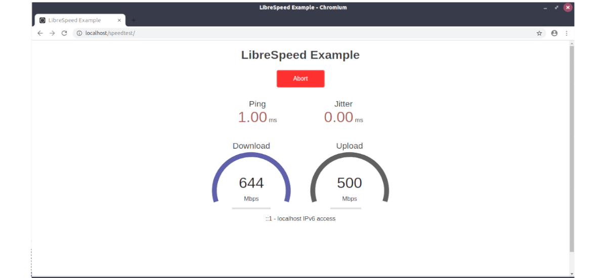

<!--
Nota bene : ce README est automatiquement généré par <https://github.com/YunoHost/apps/tree/master/tools/readme_generator>
Il NE doit PAS être modifié à la main.
-->

# LibreSpeed pour YunoHost

[](https://dash.yunohost.org/appci/app/librespeed)  

[](https://install-app.yunohost.org/?app=librespeed)

*[Lire le README dans d'autres langues.](./ALL_README.md)*

> *Ce package vous permet d’installer LibreSpeed rapidement et simplement sur un serveur YunoHost.*  
> *Si vous n’avez pas YunoHost, consultez [ce guide](https://yunohost.org/install) pour savoir comment l’installer et en profiter.*

## Vue d’ensemble

Test de vitesse auto-hébergé pour HTML5 et plus. Configuration facile, exemples, configurable, adapté aux appareils mobiles. Prend en charge PHP, Node, plusieurs serveurs, etc.

### Caractéristiques

- Télécharger
- pinger
- Gigue
- Adresse IP, FAI, distance du serveur (facultatif)
- Télémétrie (facultatif)
- Partage des résultats (facultatif)
- Plusieurs points de test (facultatif)

**Version incluse :** 5.3.2~ynh1

**Démo :** <https://librespeed.org>

## Captures d’écran



## Documentations et ressources

- Site officiel de l’app : <https://librespeed.org>
- Documentation officielle utilisateur : <https://github.com/librespeed/speedtest/wiki>
- Documentation officielle de l’admin : <https://github.com/librespeed/speedtest/wiki>
- Dépôt de code officiel de l’app : <https://github.com/librespeed/speedtest>
- YunoHost Store : <https://apps.yunohost.org/app/librespeed>
- Signaler un bug : <https://github.com/YunoHost-Apps/librespeed_ynh/issues>

## Informations pour les développeurs

Merci de faire vos pull request sur la [branche `testing`](https://github.com/YunoHost-Apps/librespeed_ynh/tree/testing).

Pour essayer la branche `testing`, procédez comme suit :

```bash
sudo yunohost app install https://github.com/YunoHost-Apps/librespeed_ynh/tree/testing --debug
ou
sudo yunohost app upgrade librespeed -u https://github.com/YunoHost-Apps/librespeed_ynh/tree/testing --debug
```

**Plus d’infos sur le packaging d’applications :** <https://yunohost.org/packaging_apps>
