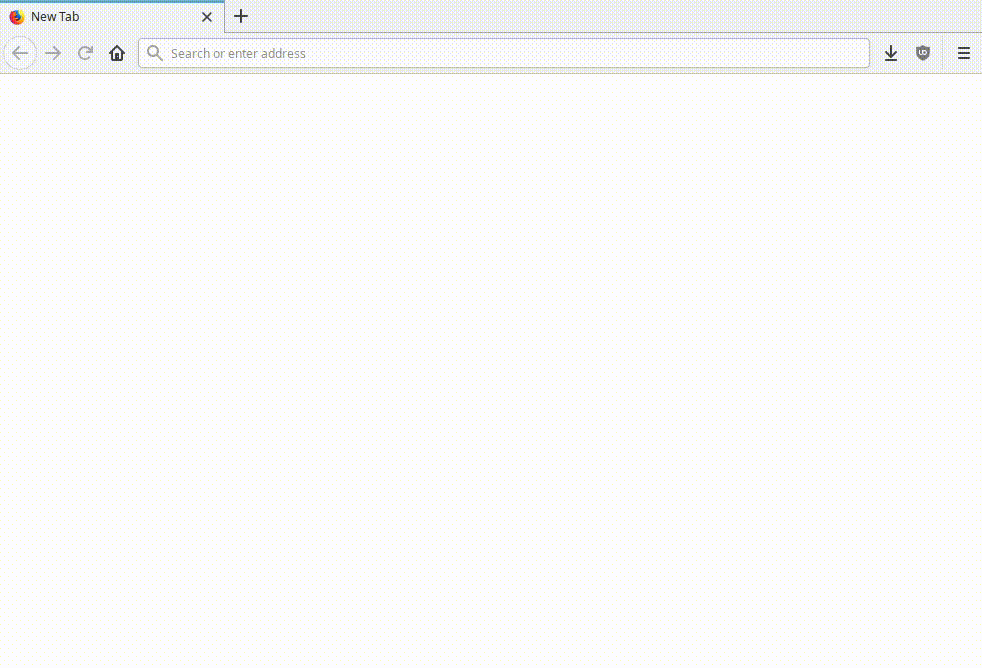

<!--
N.B.: This README was automatically generated by https://github.com/YunoHost/apps/tree/master/tools/README-generator
It shall NOT be edited by hand.
-->

# LibreSpeed pour YunoHost

[](https://dash.yunohost.org/appci/app/librespeed)  

[](https://install-app.yunohost.org/?app=librespeed)

*[Read this readme in english.](./README.md)*

> *Ce package vous permet d’installer LibreSpeed rapidement et simplement sur un serveur YunoHost.
Si vous n’avez pas YunoHost, regardez [ici](https://yunohost.org/#/install) pour savoir comment l’installer et en profiter.*

## Vue d’ensemble

Test de vitesse de connexion très léger.

**Version incluse :** 5.2.5~ynh1

**Démo :** https://librespeed.org

## Captures d’écran



## Avertissements / informations importantes

* Any known limitations, constrains or stuff not working :
    * Please visit [Troubleshooting, common problems, known limitations](https://github.com/librespeed/speedtest/wiki/Troubleshooting,-common-problems,-known-limitations) for more informations.
    * Important: ID obfuscation currently only works on 64-bit PHP! You might want to set `$redact_ip_addresses` to true in `results/telemetry_settings.php`, this way, all IP addresses will be removed from the telemetry for better privacy. This is disabled by default.

* Other infos that people should be aware of :
    * A basic front-end for visualizing and searching tests by ID is available in `domain.tld/results/stats.php`. A password is asked to you during installation steps to access this page. 

## Documentations et ressources

* Site officiel de l’app : <https://librespeed.org>
* Documentation officielle utilisateur : <https://github.com/librespeed/speedtest/wiki>
* Documentation officielle de l’admin : <https://github.com/librespeed/speedtest/wiki>
* Dépôt de code officiel de l’app : <https://github.com/librespeed/speedtest>
* Signaler un bug : <https://github.com/YunoHost-Apps/librespeed_ynh/issues>

## Informations pour les développeurs

Merci de faire vos pull request sur la [branche testing](https://github.com/YunoHost-Apps/librespeed_ynh/tree/testing).

Pour essayer la branche testing, procédez comme suit.

``` bash
sudo yunohost app install https://github.com/YunoHost-Apps/librespeed_ynh/tree/testing --debug
ou
sudo yunohost app upgrade librespeed -u https://github.com/YunoHost-Apps/librespeed_ynh/tree/testing --debug
```

**Plus d’infos sur le packaging d’applications :** <https://yunohost.org/packaging_apps>