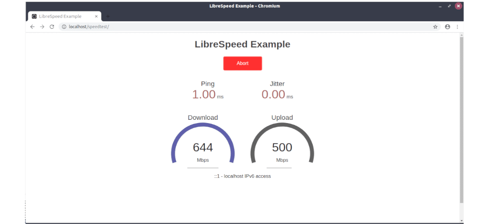

<!--
注意：此 README 由 <https://github.com/YunoHost/apps/tree/master/tools/readme_generator> 自动生成
请勿手动编辑。
-->

# YunoHost 上的 LibreSpeed

[](https://ci-apps.yunohost.org/ci/apps/librespeed/)  

[](https://install-app.yunohost.org/?app=librespeed)

*[阅读此 README 的其它语言版本。](./ALL_README.md)*

> *通过此软件包，您可以在 YunoHost 服务器上快速、简单地安装 LibreSpeed。*  
> *如果您还没有 YunoHost，请参阅[指南](https://yunohost.org/install)了解如何安装它。*

## 概况

Self-hosted Speed Test for HTML5 and more. Easy setup, examples, configurable, mobile friendly. Supports PHP, Node, Multiple servers, and more.

### Features

- Download
- Upload
- Ping
- Jitter
- IP Address, ISP, distance from server (optional)
- Telemetry (optional)
- Results sharing (optional)
- Multiple Points of Test (optional)


**分发版本：** 5.4.1~ynh1

**演示：** <https://librespeed.org>

## 截图



## 文档与资源

- 官方应用网站： <https://librespeed.org>
- 官方用户文档： <https://github.com/librespeed/speedtest/wiki>
- 官方管理文档： <https://github.com/librespeed/speedtest/wiki>
- 上游应用代码库： <https://github.com/librespeed/speedtest>
- YunoHost 商店： <https://apps.yunohost.org/app/librespeed>
- 报告 bug： <https://github.com/YunoHost-Apps/librespeed_ynh/issues>

## 开发者信息

请向 [`testing` 分支](https://github.com/YunoHost-Apps/librespeed_ynh/tree/testing) 发送拉取请求。

如要尝试 `testing` 分支，请这样操作：

```bash
sudo yunohost app install https://github.com/YunoHost-Apps/librespeed_ynh/tree/testing --debug
或
sudo yunohost app upgrade librespeed -u https://github.com/YunoHost-Apps/librespeed_ynh/tree/testing --debug
```

**有关应用打包的更多信息：** <https://yunohost.org/packaging_apps>
